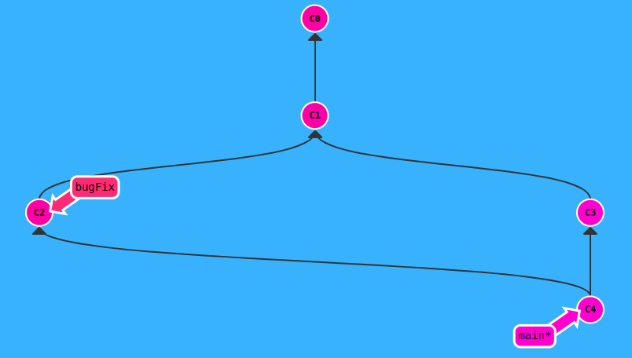

# Learning GIT 

## Learning GIT BRANCHING

Use this url of git branching https://learngitbranching.js.org/ to learn git online. 
I am keeping track of the lessons and some side material here =).

### GIT add 
If files that have been added but shouldn't check here https://www.freecodecamp.org/news/undo-git-add-how-to-remove-added-files-in-git/

### Git commit
A commit in a git repository records a snapshot of all the (tracked) files in your directory. It's like a giant copy and paste.
Git wants to keep commits as lightweight as possible though, so it doesn't just blindly copy the entire directory every time you commit. It can (when possible) compress a commit as a set of changes, or a "delta", from one version of the repository to the next.

Git also maintains a history of which commits were made when. That's why most commits have ancestor commits above them.
```shell
git commit 
```

### Branches in Git 
Are incredibly lightweight aand they are simply pointers to a specific commit.
Because there is no storage / memory overhead with making many branches, it's easier to logically divide up your work than have big beefy branches.

```shell
git checkout <name_of_branch>
git commit
```

**Shortcut:** if you want to create a new branch AND check it out at the same time, you can simply type 
```shell
git checkout -b <yourbranchname>.
```

**Note:** 
In Git version 2.23, a new command called git switch was introduced to eventually replace git checkout, which is somewhat overloaded (it does a bunch of different things depending on the arguments). The lessons here will still use checkout instead of switch because the switch command is still considered experimental and the syntax may change in the future. However you can still try out the new switch command in this application, and also learn more here https://git-scm.com/docs/git-switch.

### Merging in GIT
Now we need to learn some kind of way of combining the work from two different branches together. This will allow us to branch off, develop a new feature, and then combine it back in.

#### Merge
Merging in Git creates a special commit that has two unique parents. A commit with two parents essentially means "I want to include all the work from this parent over here and this one over here, and the set of all their parents."

<p align="center">

</p>

- Solution to 3rd exercise

```shell
git checkout -b bugFix
git commit 
git checkout main
git commit 
git merge bugFix
```

#### Rebase
The second way of combining work between branches is rebasing. Rebasing essentially takes a set of commits, "copies" them, and plops them down somewhere else.

While this sounds confusing, the advantage of rebasing is that it can be used to make a nice linear sequence of commits. 
The *commit log / history* of the repository will be a lot cleaner if only rebasing is allowed.

<p align="center">

</p>


- Solution to problem 4

We would like to move our work from bugFix directly onto the work from main. That way it would look like these two features were developed sequentially, when in reality they were developed in parallel.
```shell
git checkout -b bugFix
git commit 
git checkout main
git commit
git checkout bugFix
git rebase main
```

#### Moving around in GIT

1. **HEAD** HEAD is the symbolic name for the currently checked out commit -- it's essentially what commit you're working on top of. HEAD always points to the most recent commit which is reflected in the working tree. Most git commands which make changes to the working tree will start by changing HEAD. Normally HEAD points to a branch name (like bugFix). When you commit, the status of bugFix is altered and this change is visible through HEAD.

	- Detaching HEAD: Detaching HEAD just means attaching it to a commit instead of a branch. This is what it looks like beforehand: `HEAD -> main -> C1`
	- Detaching the head of `bugFix` and attaching it to the commit is achieved by using `git checkout C4`.
	- Way more information about HEAD here https://initialcommit.com/blog/what-is-git-head#:~:text=In%20Git%2C%20a%20head%20is,recent%20commit)%20of%20that%20branch.
